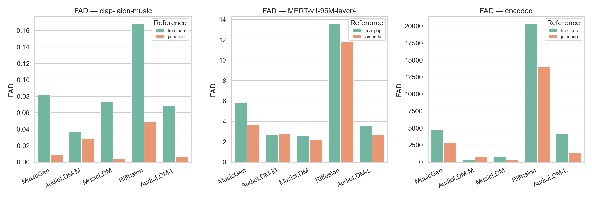
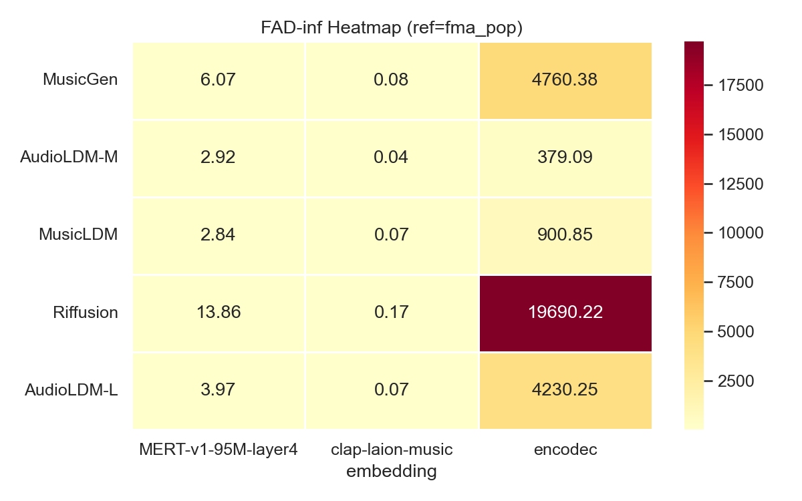
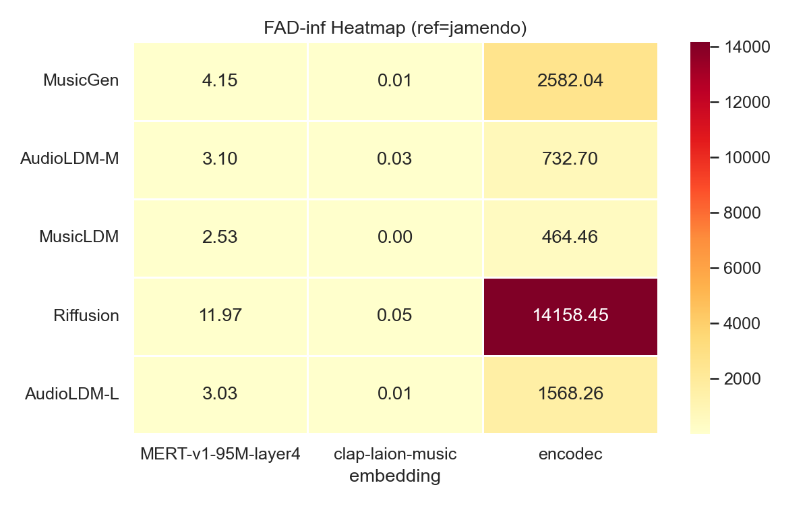
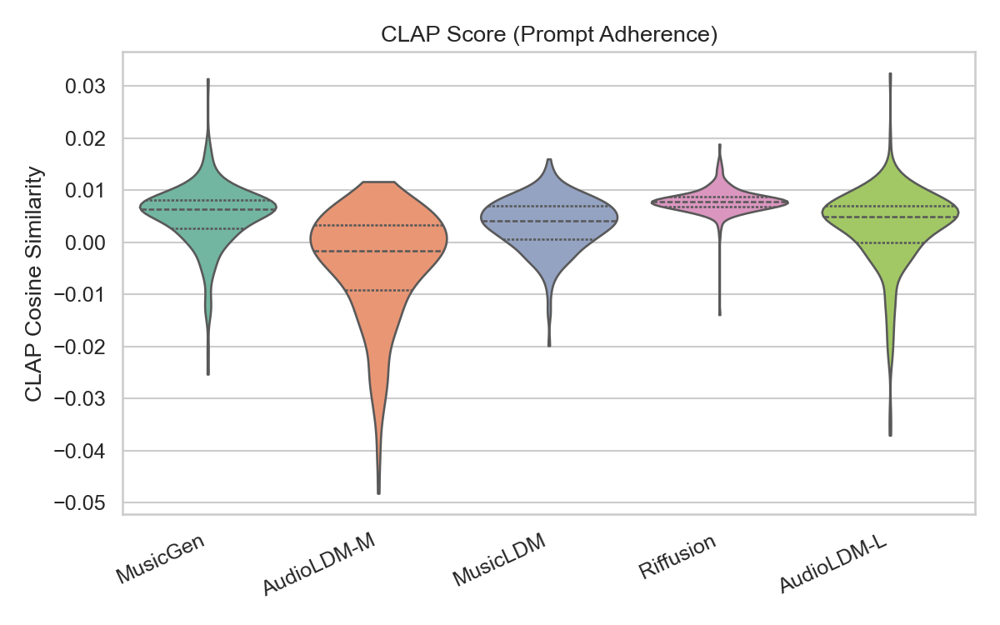
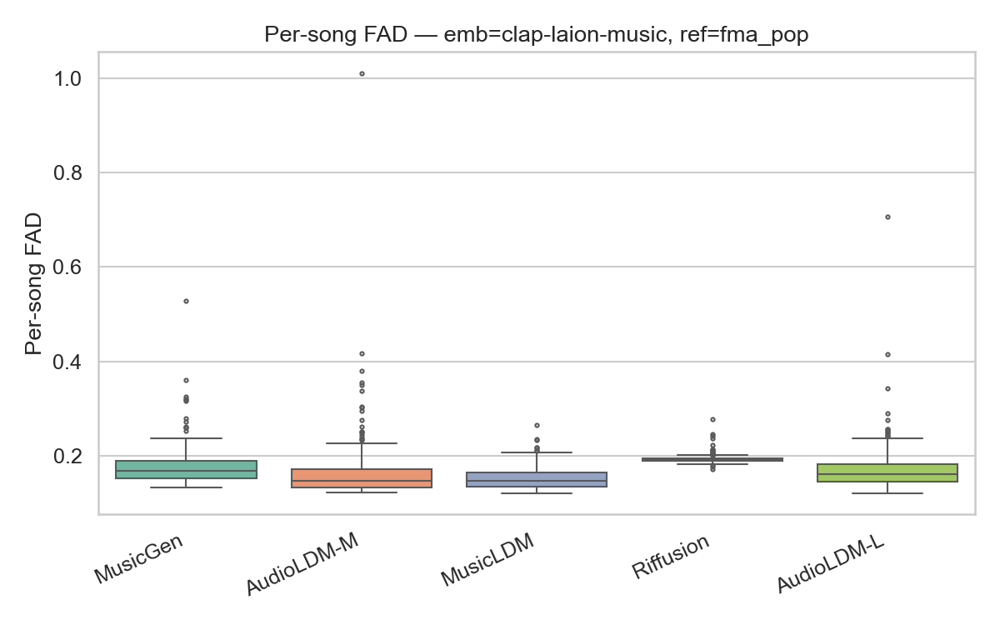
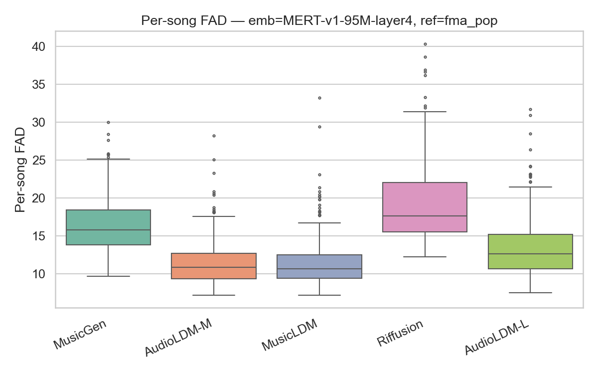
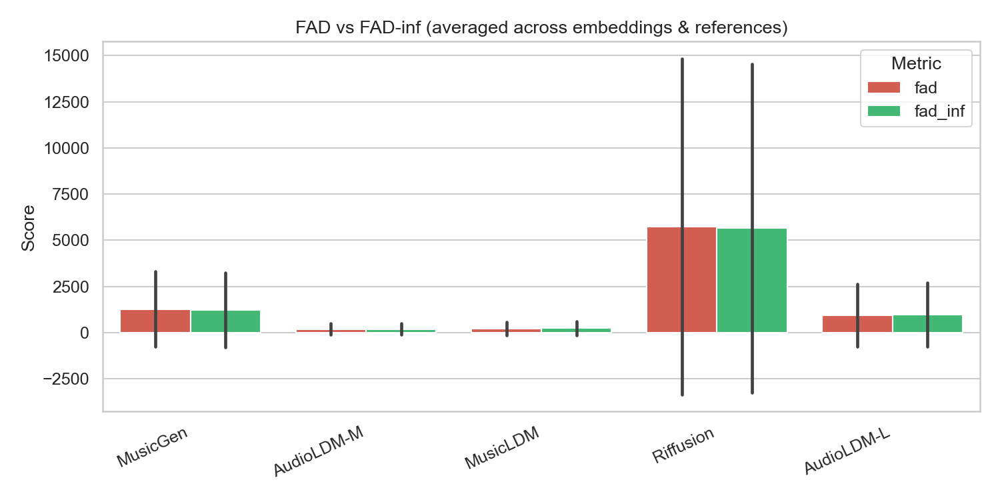

# Сравнительная оценка open-source моделей генерации музыки по тексту

Воспроизводимый pipeline для количественного сравнения пяти open-source моделей
text-to-music генерации с использованием Fréchet Audio Distance (FAD), FAD-inf
и CLAP Score на двух эталонных датасетах.

Научно-исследовательская работа — МГТУ им. Н.Э. Баумана, каф. ИУ5, 2026 г.  
Автор: Давшиц С.А.

---

## Модели

| Модель | Архитектура | HuggingFace ID | SR |
|--------|-------------|----------------|----|
| MusicGen | Авторегрессионный трансформер + EnCodec | `facebook/musicgen-small` | 32 000 Гц |
| AudioLDM-M | Латентная диффузия + CLAP (средняя) | `cvssp/audioldm-m-full` | 16 000 Гц |
| AudioLDM-L | Латентная диффузия + CLAP (большая) | `cvssp/audioldm-l-full` | 16 000 Гц |
| MusicLDM | Латентная диффузия, beat-sync mixup | `ucsd-reach/musicldm` | 16 000 Гц |
| Riffusion | Дообученный Stable Diffusion на спектрограммах | `riffusion/riffusion-model-v1` | 44 100 Гц |

## Метрики

| Метрика | Описание |
|---------|----------|
| **FAD** | Fréchet Audio Distance — расстояние между распределениями эмбеддингов реальных и сгенерированных треков |
| **FAD-inf** | Экстраполяция FAD к N→∞ линейной регрессией по (1/N, FAD); устраняет смещение малой выборки |
| **Per-song FAD** | FAD для каждого отдельного трека; позволяет выявлять выбросы |
| **CLAP Score** | Косинусное сходство между эмбеддингами текстового промпта и сгенерированного аудио |

**Эмбеддинг-модели для FAD:** CLAP-LAION-Music, MERT-v1-95M (слой 4), EnCodec.

**Эталонные датасеты:**
- `fma_pop` — 500 треков из Free Music Archive (FMA Small)
- `jamendo` — 500 клипов из MTG-Jamendo (Creative Commons, Universitat Pompeu Fabra)

---

## Установка

```bash
pip install -r requirements.txt
```

Дополнительно требуется `ffmpeg` в системе (для конвертации аудио при подготовке датасета Jamendo):

```bash
# macOS
brew install ffmpeg
```

---

## Запуск

### 1. Генерация музыки

```bash
# Все модели, 250 промптов
python generate.py --models all --num-prompts 250

# Только конкретные модели
python generate.py --models musicgen audioldm --num-prompts 10

# Возобновить с промпта №50
python generate.py --models musicgen --start-index 50 --num-prompts 200
```

Результаты сохраняются в `outputs/generated/<model_name>/`.

### 2. Вычисление метрик

```bash
# Полная оценка по обоим датасетам (с загрузкой при первом запуске)
python evaluate.py --references fma_pop jamendo --download-references

# Только FAD, без per-song и CLAP (быстро)
python evaluate.py --references fma_pop jamendo --skip-per-song --skip-clap

# Конкретные эмбеддинги
python evaluate.py --embeddings clap-laion-music MERT-v1-95M-layer4 --references fma_pop
```

Результаты: `outputs/results/fad_results.csv`, `outputs/results/clap_results.csv`.

> **Важно:** каждый запуск `evaluate.py` перезаписывает CSV. Чтобы получить результаты
> по обоим датасетам в одном файле, передавайте оба через `--references fma_pop jamendo`
> в одном вызове.

### 3. Визуализация

```bash
python analyze.py

# Кастомные пути
python analyze.py --results-dir outputs/results --plots-dir outputs/plots
```

Графики сохраняются в `outputs/plots/`.

---

## Структура проекта

```
├── config.py                   # Пути, имена моделей, параметры
├── generate.py                 # Генерация аудио всеми моделями
├── evaluate.py                 # FAD, FAD-inf, CLAP Score
├── analyze.py                  # Построение графиков
├── make_report.py              # Генерация DOCX-отчёта
│
├── generators/
│   ├── base.py                 # Базовый класс генератора
│   ├── musicgen_gen.py         # MusicGen
│   ├── audioldm2_gen.py        # AudioLDM-M
│   ├── ace_step_gen.py         # AudioLDM-L
│   ├── mustango_gen.py         # MusicLDM
│   └── riffusion_gen.py        # Riffusion
│
├── evaluation/
│   ├── fad_evaluator.py        # Вычисление FAD и FAD-inf
│   ├── metrics.py              # CLAP Score, per-song FAD
│   └── reference_sets.py       # Загрузка и подготовка эталонных датасетов
│
├── prompts/
│   └── prompts.json            # 250 текстовых промптов
│
├── requirements.txt
│
└── outputs/
    ├── generated/              # Сгенерированные WAV-файлы
    ├── reference/              # Эталонные датасеты (fma_pop, jamendo)
    ├── embeddings/             # Кешированные эмбеддинги
    ├── results/                # fad_results.csv, clap_results.csv
    └── plots/                  # PNG-графики
```

---

## Результаты

### FAD-inf по двум датасетам

FAD-inf (референс: FMA-Pop), меньше — лучше:

| Модель | CLAP-FAD | MERT-FAD | EnCodec-FAD |
|--------|----------|----------|-------------|
| **AudioLDM-M** | **0.039** | **2.93** | **379** |
| MusicLDM | 0.074 | 2.84 | 901 |
| AudioLDM-L | 0.072 | 3.97 | 4230 |
| MusicGen | 0.084 | 6.07 | 4760 |
| Riffusion | 0.169 | 13.86 | 19690 |

FAD-inf (референс: MTG-Jamendo), меньше — лучше:

| Модель | CLAP-FAD | MERT-FAD | EnCodec-FAD |
|--------|----------|----------|-------------|
| **MusicLDM** | **0.0044** | **2.53** | **465** |
| AudioLDM-L | 0.0074 | 3.03 | 1568 |
| MusicGen | 0.0098 | 4.15 | 2582 |
| AudioLDM-M | 0.0302 | 3.10 | 733 |
| Riffusion | 0.0498 | 11.97 | 14159 |

### Визуализации

**FAD по моделям и эмбеддингам (оба референса)**



**Тепловые карты FAD-inf**

| FMA-Pop | MTG-Jamendo |
|---------|-------------|
|  |  |

**CLAP Score — соответствие промпту (ящик с усами)**



**Per-song FAD — разброс по отдельным трекам (ящики с усами)**

| CLAP-эмбеддинг | MERT-эмбеддинг |
|----------------|----------------|
|  |  |

**FAD vs FAD-inf**



---

## Выводы

- **AudioLDM-M** — лучший по FAD на FMA-Pop (CLAP: 0.039, MERT: 2.93, EnCodec: 379); рекомендуется для задач, где важна акустическая близость к реальной музыке.
- **MusicLDM** — лучший по FAD на MTG-Jamendo (CLAP: 0.0044, MERT: 2.53, EnCodec: 465); наиболее стабильный per-song FAD.
- **Riffusion** — худший FAD по всем эмбеддингам и датасетам, но лучший CLAP Score (0.0079): хорошо следует промпту при слабой акустической реалистичности.
- **FAD и FAD-inf** практически совпадают при 250 треках — размера выборки достаточно для устойчивой оценки.
- **Смена референсного датасета** меняет лидера: на FMA-Pop первый AudioLDM-M, на MTG-Jamendo — MusicLDM. Это подчёркивает важность оценки на нескольких датасетах.
- **Увеличение размера модели** (AudioLDM-M → AudioLDM-L) не даёт улучшения: AudioLDM-L значительно уступает по EnCodec-FAD (4230 против 379 на FMA-Pop).
